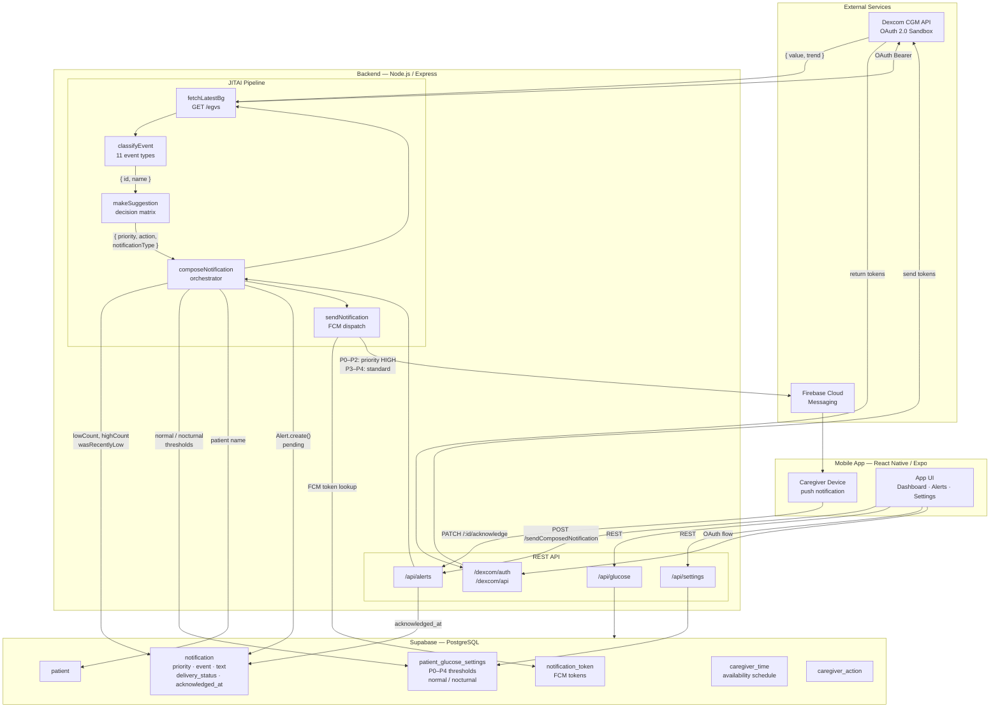

# GlucoseCare Backend Architecture

**Version:** 2.0  
**Last Updated:** May 2026  
**Authors:** Aidan Schooley, Sarah Winne

---

## Overview

GlucoseCare is a context-aware, just-in-time adaptive notification system for caregivers of children with Type 1 Diabetes. The backend implements the JITAI (Just-in-Time Adaptive Intervention) framework to reduce caregiver alarm fatigue while keeping patient safety as the top priority.

### Goals

- **Reduce Alarm Fatigue:** Smart filtering based on priority, event type, and context
- **Improve Sleep Quality:** Nocturnal context awareness minimizes unnecessary nighttime interruptions
- **Provide Decision Support:** ADA protocol-based suggestions reduce caregiver decision fatigue
- **Maintain Safety:** P0/P1 alerts always use high-priority, interruptive delivery

### Technology Stack

| Layer | Technology |
|---|---|
| Runtime | Node.js + Express.js |
| Database | PostgreSQL via Supabase |
| Push Notifications | Firebase Cloud Messaging (FCM) |
| CGM Data | Dexcom Developer API (OAuth 2.0 Sandbox) |
| Language | JavaScript (ESM) |

---

## JITAI Framework

The six JITAI components map directly to backend components:

| Component | GlucoseCare |
|---|---|
| Distal Outcome | Reduced caregiver alarm fatigue and improved sleep |
| Proximal Outcome | Faster alert response, reduced dismissal rate, reduced dismissal without action |
| Decision Point | Blood glucose readings (every 5 minutes from Dexcom) |
| Tailoring Variables | BG value, BG trend, alert type, alert state, time of day, history, caregiver availability |
| Intervention Options | Interruptive (P0–P1), Informative (P2–P3), Passive (P4 / encouragement) |
| Decision Rules | Safety layer → event classifier → suggestion |

---

## Architecture Flowchart



---

## Directory Structure

```
backend/
├── app.js                              # Express app: routes, middleware
├── server.js                           # Entry point
│
├── config/
│   ├── database.js                     # pg pool (Supabase)
│   └── firebase.js                     # Firebase Admin SDK
│
├── models/
│   ├── Alert.js                        # notification table (alert + delivery)
│   ├── CGMReading.js
│   ├── Caregiver.js
│   ├── CaregiverAction.js
│   ├── CaregiverTime.js
│   ├── Notification.js
│   ├── Patient.js
│   ├── PatientCaregiver.js
│   └── PatientGlucoseSettings.js
│
├── services/
│   ├── jitai/
│   │   ├── classifyEvent.js            # 11 event types + trend parsing
│   │   ├── classifyPriority.js         # P0–P4 safety layer
│   │   ├── makeSuggestion.js           # Decision matrix + ADA protocols
│   │   └── composeNotification.js      # Pipeline orchestrator
│   │
│   ├── notifications/
│   │   ├── sendNotification.js         # Firebase FCM dispatch
│   │   └── Tokens.js                   # FCM token store/lookup
│   │
│   ├── dexcom/
│   │   ├── fetchLatestBg.js            # GET /egvs from Dexcom sandbox
│   │   ├── fetchLatest.js
│   │   ├── fetchDataRange.js
│   │   ├── formatDataRange.js
│   │   └── tokenService.js             # Dexcom OAuth token retrieval
│   │
│   ├── patient/
│   │   └── patientService.js
│   │
│   └── settings/
│       └── patientGlucoseSettings.js   # Threshold lookup (normal / nocturnal)
│
├── controllers/
│   ├── alertController.js
│   ├── caregiverController.js
│   ├── glucoseController.js
│   ├── notificationController.js
│   ├── patientController.js
│   └── settingsController.js
│
├── routes/
│   ├── actions.js
│   ├── alert.js
│   ├── caregivers.js
│   ├── glucose.js
│   ├── patients.js
│   ├── settings.js
│   └── dexcomApi/
│       ├── authentication.js
│       ├── datarange.js
│       └── glucoseApi.js
│
└── documents/
    ├── ARCHITECTURE.md
    ├── API_ENDPOINTS.md
    └── EVENT_IDS.md
```

---

## Data Flow

```
Dexcom Sandbox API
       │
       │  GET /v3/users/self/egvs (OAuth 2.0 Bearer)
       ▼
fetchLatestBg.js
       │  { value, trend, systemTime }
       ▼
composeNotification.js  ◄── orchestrates the full pipeline
       │
       ├── getPatientGlucoseSettingsByTime()   reads normal / nocturnal thresholds
       ├── getPatientNameById()
       ├── Alert.countRecentByType()           low / high counts in last 60 min
       └── Alert.wasRecentlyLow()              recovering detection (30 min)
       │
       ▼
classifyEvent.js
       │  { id, name, description }  (one of 11 event types)
       ▼
makeSuggestion.js
       │  { priority, notificationType, action, followUp, escalate }
       ▼
Alert.create()          logs to notification table (delivery_status = 'pending')
       │
       ▼
sendNotification.js
       │  looks up FCM token → builds Firebase message
       │  P0/P1/P2 → android priority HIGH + MAX channel
       │  P3/P4    → standard priority
       ▼
Firebase Cloud Messaging  →  Caregiver's mobile device
       │
       └── Alert.updateDeliveryStatus('sent' | 'failed')
```

---

## Safety Detection Layer (`classifyPriority.js`)

Thresholds are read from `patient_glucose_settings` and vary by time of day (normal vs. nocturnal). Default ADA-based values:

| Priority | Blood Glucose | Description |
|---|---|---|
| P0 | < 54 mg/dL | ADA Level 2 Hypoglycemia — always interruptive |
| P1 | 54–69 mg/dL | ADA Level 1 Hypoglycemia — always interruptive |
| P2 | > 250 mg/dL | Severe Hyperglycemia |
| P3 | 180–250 mg/dL | Mild Hyperglycemia |
| P4 | 70–180 mg/dL | In Range |

---

## Event Classification Layer (`classifyEvent.js`)

Inputs: `glucose`, `trend` (string or numeric), `lowCountLastHour`, `highCountLastHour`, `isNocturnal`, `isRecovering`

**Trend rates** (`parseTrend`): `doubleDown (−3)` … `flat (0)` … `doubleUp (+3)`

| ID | Event | Condition |
|---|---|---|
| 1 | critical low | glucose ≤ 54 |
| 2 | nocturnal low | glucose ≤ 70 AND isNocturnal |
| 3 | standard low | glucose ≤ 70 |
| 4 | repeated unresolved low | glucose ≤ 70 AND lowCount ≥ 3/60 min |
| 5 | trending low | glucose > 70 AND trend < −2 (doubleDown) |
| 6 | severe high | glucose ≥ 250 |
| 7 | mild high | 180 ≤ glucose < 250 |
| 8 | repeated unresolved high | glucose ≥ 250 AND highCount ≥ 3/60 min |
| 9 | repeated unresolved mild | 180 ≤ glucose < 250 AND highCount ≥ 3/60 min |
| 10 | recovering | 70–180 AND wasRecentlyLow |
| 11 | in range | 70–180 AND stable |

---

## Suggestion Layer (`makeSuggestion.js`)

A decision matrix maps each event ID to an ADA-backed action:

| Event | Notification Type | Protocol |
|---|---|---|
| 1 critical low | Interruptive | 25 g carbs; glucagon if unresponsive; call 911 |
| 2 nocturnal low | Interruptive | 15/15 rule; protein snack follow-up |
| 3 standard low | Interruptive | 15/15 rule |
| 4 repeated unresolved low | Interruptive | 15/15 + glucagon; escalate to doctor |
| 5 trending low | Informative | Fast carbs now to prevent low |
| 6 severe high | Informative | Check ketones; bolus + hydrate |
| 7 mild high | Informative | Conservative correction; hydrate |
| 8 repeated unresolved high | Informative | Ketone check; escalate |
| 9 repeated unresolved mild | Informative | Consider correction; recheck 2h |
| 10 recovering | Passive | Stop carbs; monitor |
| 11 in range | Passive | Good work |

**Notification types:**
- `interruptive` — P0/P1: high-priority FCM, bypasses DND on Android
- `informative` — P2/P3: standard FCM
- `passive` — P4: encouragement, no urgency

---

## Database Schema

All alert and notification data is stored in a single `notification` table. The `Alert` model owns this table and handles both the clinical event side and the delivery side.

**Key tables:**

| Table | Purpose |
|---|---|
| `notification` | One row per alert: event classification, priority, composed text, suggestion, delivery status, acknowledged_at |
| `patient_glucose_settings` | Per-patient thresholds for P0–P4, split into normal and nocturnal profiles |
| `patient` | Patient info; looked up by ID for notification title |
| `caregiver` | Caregiver info |
| `patient_caregiver` | Many-to-many patient↔caregiver with role |
| `caregiver_time` | Availability schedule (planned for routing) |
| `caregiver_action` | Actions logged by caregiver in response to alerts |
| `notification_token` | FCM tokens keyed by user ID |

**`notification` columns used by the pipeline:**

```
setting_id           → links to patient_glucose_settings
patient_id
caregiver_id
priority_level       → P0–P4
event_classification → event name string
text                 → notification title
suggestion           → action + follow-up body
encouragment         → set for passive notifications
delivery_status      → pending | sent | failed
acknowledged_at      → set when caregiver taps acknowledge
created_at
```

---

## API Endpoints

### Alerts / Notifications (`/api/alerts`)

| Method | Path | Description |
|---|---|---|
| GET | `/api/alerts/:patientId` | All alerts for a patient |
| GET | `/api/alerts/notifications/:id` | P0–P2 alerts for a patient |
| POST | `/api/alerts` | Log an alert manually |
| PATCH | `/api/alerts/:id/acknowledge` | Mark alert acknowledged |
| POST | `/api/alerts/registerFCMToken` | Register device FCM token |
| POST | `/api/alerts/sendNotification` | Send a raw manual push |
| POST | `/api/alerts/sendComposedNotification` | Run full JITAI pipeline (fetch live BG) |
| POST | `/api/alerts/sendComposedNotification/:bg` | Run pipeline with injected BG value |

### Other App Routes

| Prefix | Purpose |
|---|---|
| `/api/patients` | Patient CRUD |
| `/api/glucose` | CGM reading queries |
| `/api/settings` | Patient glucose settings |

### Dexcom OAuth & Data

| Prefix | Purpose |
|---|---|
| `/dexcom/auth` | OAuth 2.0 login flow |
| `/dexcom/api` | Glucose readings + data range proxy |

---

## External Integrations

### Dexcom Developer API (Sandbox)
- **Auth:** OAuth 2.0 — user grants access, tokens stored in session
- **Endpoint used:** `GET /v3/users/self/egvs` via `fetchLatestBg.js`
- **Current state:** Sandbox mode with test data

### Firebase Cloud Messaging
- **SDK:** Firebase Admin (`firebase-admin`)
- **Config:** `config/firebase.js`
- **Priority:** P0–P2 sends `android.priority = 'high'` + `notification.priority = 'MAX'`
- **Token management:** `services/notifications/Tokens.js` (stored in `notification_token` table)

### Supabase (PostgreSQL)
- **Client:** `pg` connection pool in `config/database.js`
- **Eight tables** listed above

---

## References

- American Diabetes Association — Hypoglycemia classification and treatment protocols
- Nahum-Shani et al. — Just-in-Time Adaptive Interventions (JITAIs) in Mobile Health
- Nava-Muñoz & Morán — CANoE: Context-Aware Notification Model for Nursing Homes
- Kaylor & Morrow — Alarm fatigue and sleep deprivation in CGM caregivers
- Giza et al. — Can Glucose Alarm Fatigue Threaten CGM Clinical Benefit?

---

*This document describes the GlucoseCare backend as implemented for "GlucoseCare: A Context-Aware Just-in-Time Adaptive Notification System for Caregivers of Children with Type 1 Diabetes" (Schooley & Winne, Houghton University, 2026)*
